# Proyek Praktik Kerja Lapangan

## Soil Fertility Detection System

### Hardware Specification

- Microcontroller
  - Arduino Nano  
    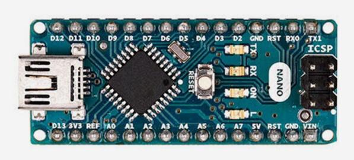

- Sensor
  - Soil Ph Meter Sensor  
    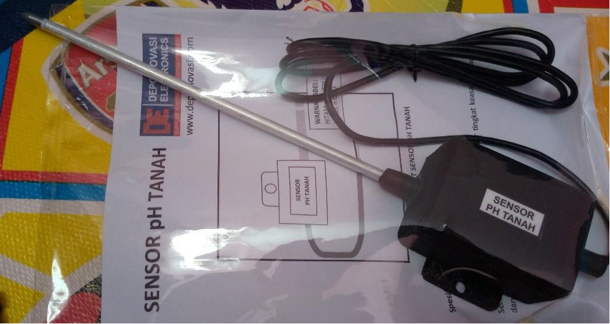

  - Capacitive Soil Moisture Sensor  
    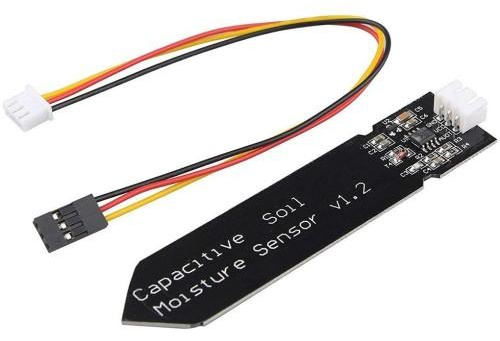
  
  - GPS & Location Sensor (smartphone built in)

- Actuator
  - Serial communication
  - LED
  - Buzzer

- Smartphone
  - Android smartphone with support for GPS, Location, and USB On-The-Go

### Images

System Block Diagram  
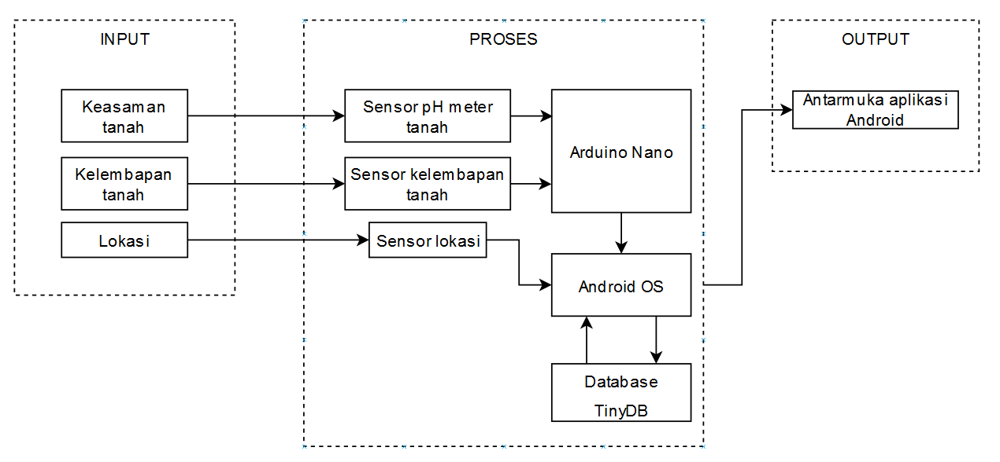

Android App Flowchart  
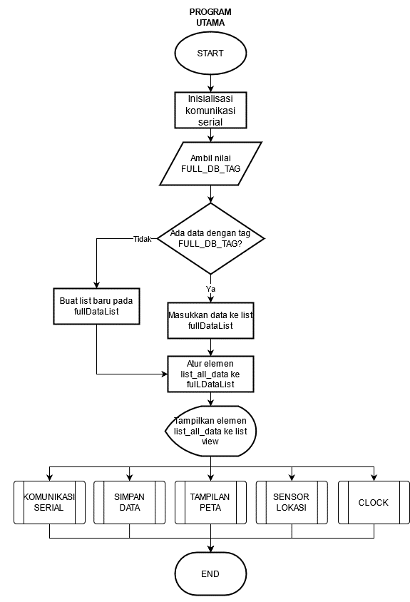

Hardware Flowchart  
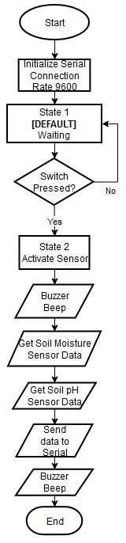

Hardware Schematic  
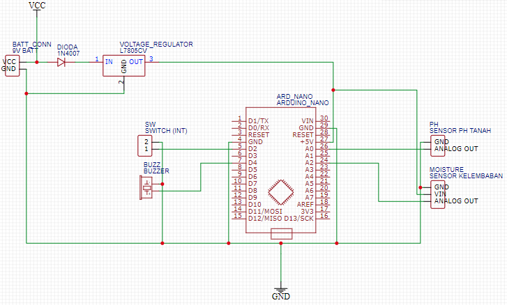

System Prototype  
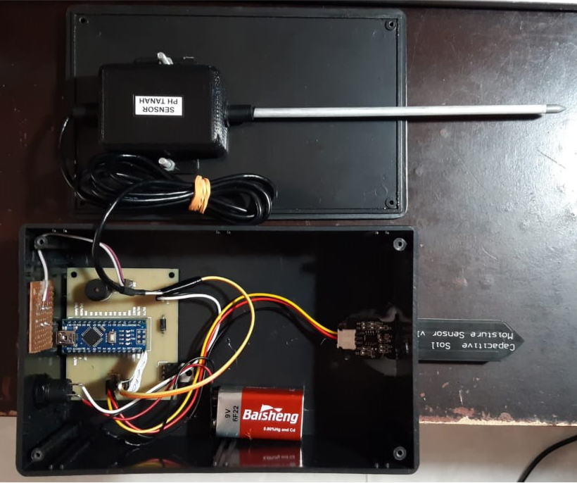

### Arduino Program code

To run the system, we need to built program to fetch the data from sensor. We using Arduino IDE to program the Arduino Nano. You can look the code in [arduino-code.ino](arduino-code.ino) file.

### Android Application code

We using Kodular to build the Android application. This platform are great and very easy to use to create simple Android application because it using block code. You can look the code blocks below.  
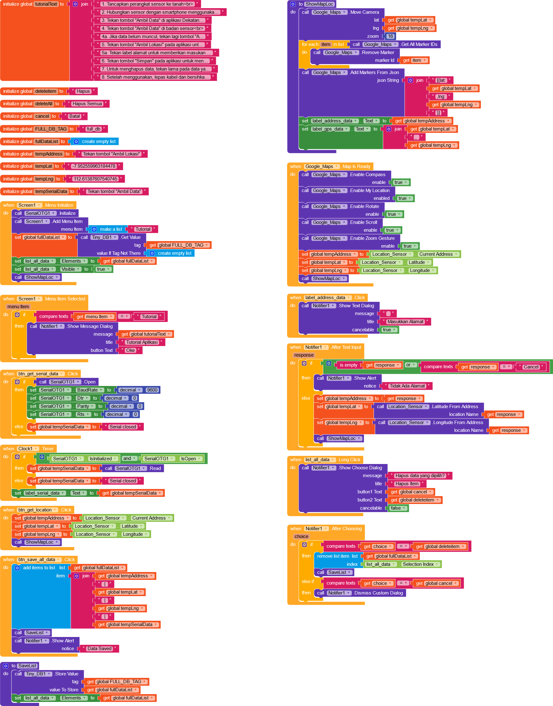

### Android Application UI

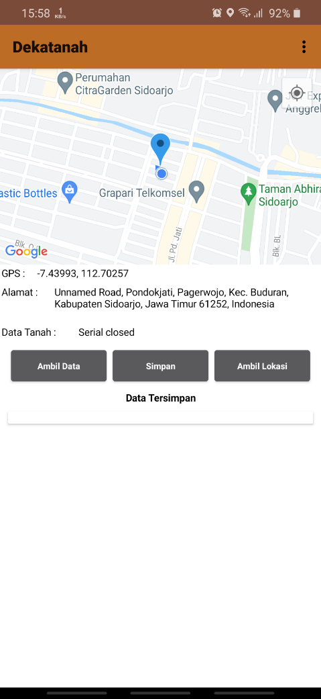

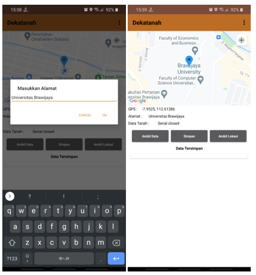

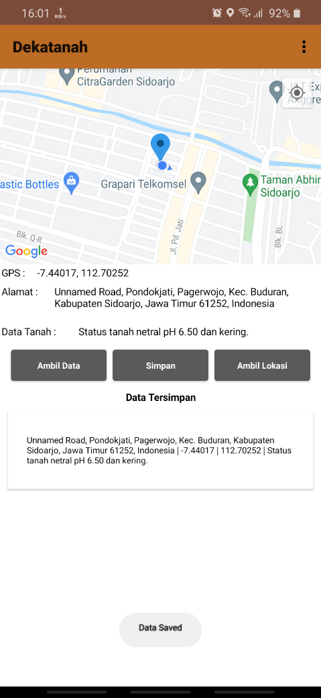
